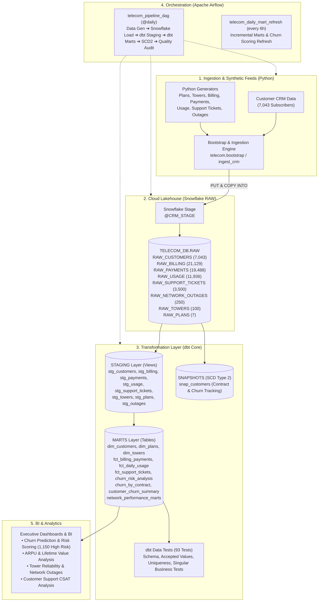

# 📡 Telecom Data Platform — End-to-End Enterprise Lakehouse & Analytics

[](https://www.snowflake.com/)
[](https://www.getdbt.com/)
[](https://airflow.apache.org/)
[](https://www.python.org/)
[](LICENSE)

An enterprise-grade, end-to-end data platform simulating a real-world telecommunications analytics lakehouse. The platform ingests customer CRM, radio access network (RAN) cell towers, billing cycles, payment transactions, subscriber cellular usage, customer service tickets, and network outages into **Snowflake**, transforms and models data into conformed dimensions and marts using **dbt**, and automates pipeline execution with **Apache Airflow**.

---

## 🏛️ Architecture Overview



---

## 🛠️ Tech Stack & Responsibilities

| Component | Technology | Responsibility |
| :--- | :--- | :--- |
| **Data Warehouse** | **Snowflake** | Cloud data storage, compute (`TELECOM_WH`), stages, and multi-schema separation (`RAW`, `STAGING`, `MARTS`). |
| **Transformations** | **dbt Core (1.10.13)** | Modular SQL transformations, conformed dimensional modeling, SCD Type 2 history snapshots, schema testing, and documentation. |
| **Orchestration** | **Apache Airflow (2.8+)** | Workflow scheduling, automated DAG task orchestration, data quality audits, Docker Compose infrastructure. |
| **Data Generation** | **Python (3.9+) & Pandas** | High-fidelity synthetic telecom data generators (plans, cell towers, usage events, support tickets, billing invoices, network outages). |
| **Version Control** | **Git & GitHub** | Infrastructure-as-code, CI/CD ready repository structure. |

---

## ❄️ Snowflake Lakehouse Architecture & Object Hierarchy

The data platform is organized across a 3-tier medallion architecture in **Snowflake**:

```mermaid
graph TD
    WH["Virtual Warehouse: TELECOM_WH (XSMALL, Auto-suspend 60s)"]
    DB[("Database: TELECOM_DB")]
    WH --> DB

    subgraph RAW ["1. Bronze Layer: TELECOM_DB.RAW"]
        R1[RAW_CUSTOMERS - 7,043 rows]
        R2[RAW_BILLING - 21,129 rows]
        R3[RAW_PAYMENTS - 19,488 rows]
        R4[RAW_USAGE - 11,936 rows]
        R5[RAW_SUPPORT_TICKETS - 3,500 rows]
        R6[RAW_NETWORK_OUTAGES - 250 rows]
        R7[RAW_TOWERS - 100 rows]
        R8[RAW_PLANS - 7 rows]
        STAGE["Stage: @CRM_STAGE"]
        FF["Format: CSV_FILE_FORMAT"]
    end

    subgraph STAGING ["2. Silver Layer: TELECOM_DB.STAGING"]
        S1[STG_CUSTOMERS - Cleaned Demographics & Contracts]
        S2[STG_BILLING - Normalized Bills & Taxes]
        S3[STG_PAYMENTS - Payment Receipts & Gateway Status]
        S4[STG_USAGE - Subscriber Daily Voice & Data MB/GB]
        S5[STG_SUPPORT_TICKETS - Turnaround Hours & CSAT]
        S6[STG_NETWORK_OUTAGES - Outage Duration & Impact]
        S7[STG_TOWERS - Cell Tower Coordinates & Vendor]
        S8[STG_PLANS - 4G/5G/Fiber Plan Pricing]
    end

    subgraph MARTS ["3. Gold Layer: TELECOM_DB.MARTS"]
        M1[DIM_CUSTOMERS - Customer Dimension + Cohorts]
        M2[DIM_PLANS - Plan Dimension]
        M3[DIM_TOWERS - Cell Tower Dimension + Availability %]
        M4[FCT_BILLING_PAYMENTS - Invoice Fulfillment Fact]
        M5[FCT_DAILY_USAGE - Cellular Consumption Fact]
        M6[FCT_SUPPORT_TICKETS - Service Resolution Fact]
        M7[CHURN_RISK_ANALYSIS - Multi-Factor Churn Scoring 0-100]
        M8[CHURN_BY_CONTRACT - Churn Rate by Contract Mart]
        M9[CUSTOMER_CHURN_SUMMARY - Executive KPI Overview]
        M10[NETWORK_PERFORMANCE_MARTS - Tower Load & Reliability]
        M11[SNAP_CUSTOMERS - SCD Type 2 Historical Tracker]
    end

    DB --> RAW
    DB --> STAGING
    DB --> MARTS

    RAW -->|dbt Staging Views| STAGING
    STAGING -->|dbt Marts Tables| MARTS
```



### Snowflake Database & Schema Breakdown

| Schema | Object Type | Objects Count | Purpose |
| :--- | :--- | :--- | :--- |
| **`RAW`** | Tables, Stage, File Format | 8 Tables, 1 Stage, 1 File Format | Bronze landing layer for direct CSV file ingestion via `COPY INTO`. |
| **`STAGING`** | Views | 8 Views | Silver layer standardizing data types, handling empty strings as NULL, and casting booleans. |
| **`MARTS`** | Tables & Snapshots | 10 Tables, 1 SCD2 Snapshot | Gold analytical layer containing conformed dimensions, transaction facts, predictive churn scores, and KPIs. |

---

## 📂 Project Directory Structure

```text
Telecom-data-platform/
│
├── README.md                      # Comprehensive platform architecture & operational guide
├── datasets/                      # Seed & generated telecom datasets
│   ├── source/crm/                # Base customer churn CRM dataset
│   ├── master/                    # Master reference data (vendors, cities, circles, plans)
│   ├── raw/crm/                   # Ingested timestamped files
│   └── generated/                 # Synthetic generator output
│       ├── billing/               # Monthly subscriber bills
│       ├── outages/               # Tower downtime & outages
│       ├── payments/              # Payment transaction logs
│       ├── plans/                 # 4G/5G/Fiber plan definitions
│       ├── support/               # Customer service tickets
│       ├── towers/                # Cell tower RAN network data
│       └── usage/                 # Daily voice/data/SMS records
│
├── snowflake/                     # Complete Snowflake Infrastructure & Analytics SQL
│   ├── README.md                  # Snowflake execution guide & object catalog
│   ├── 01_setup_warehouse_database_schemas.sql # Warehouse, DB, schemas, and role setup
│   ├── 02_file_formats_and_stages.sql          # CSV format, @CRM_STAGE, S3 integration
│   ├── 03_raw_schema_ddl_and_ingestion.sql     # 8 RAW tables DDL & COPY INTO statements
│   ├── 04_staging_layer_models.sql             # 8 STAGING view DDL definitions
│   ├── 05_marts_dimensions_and_facts.sql       # Conformed dimensions & fact tables DDL
│   ├── 06_analytics_marts_and_churn_scoring.sql# Churn risk scoring & network marts DDL
│   ├── 07_snapshots_scd2_layer.sql             # SCD Type 2 snapshot tables & point-in-time queries
│   ├── 08_data_validation_and_audit_queries.sql# Cross-layer row counts & PK uniqueness audits
│   └── 09_business_intelligence_queries.sql    # Executive dashboards & BI analytical queries
│
├── dbt/telecom_dbt/               # Production dbt Project
│   ├── dbt_project.yml            # Project configuration & schema routing
│   ├── packages.yml               # dbt-utils package dependencies
│   ├── profiles.yml               # Portable Snowflake profile config with env vars
│   ├── macros/
│   │   └── generate_schema_name.sql # Custom schema name router (STAGING / MARTS)
│   ├── models/
│   │   ├── schema.yml             # Data dictionary, column descriptions & tests
│   │   ├── overview.md            # dbt documentation overview page
│   │   ├── staging/               # Silver Layer Views
│   │   │   ├── sources.yml        # Source declarations & freshness/uniqueness tests
│   │   │   ├── stg_customers.sql  # Normalized customer demographics & contracts
│   │   │   ├── stg_plans.sql      # Plan pricing & allowances
│   │   │   ├── stg_towers.sql     # Cell tower infrastructure & coordinates
│   │   │   ├── stg_billing.sql    # Billing cycle statements
│   │   │   ├── stg_payments.sql   # Payment transactions & gateway status
│   │   │   ├── stg_usage.sql      # Daily subscriber usage metrics
│   │   │   ├── stg_support_tickets.sql # Service desk tickets & CSAT
│   │   │   └── stg_network_outages.sql # Outage incidents & impacted subscribers
│   │   └── marts/                 # Gold Layer Tables & Analytics
│   │       ├── dim_customers.sql  # Conformed customer dimension + cohorts
│   │       ├── dim_plans.sql      # Plan dimension
│   │       ├── dim_towers.sql     # Tower dimension with calculated uptime %
│   │       ├── fct_billing_payments.sql # Billing fulfillment & delinquency fact
│   │       ├── fct_daily_usage.sql# Cellular data & voice consumption fact
│   │       ├── fct_support_tickets.sql # Service issues & resolution turnaround fact
│   │       ├── churn_by_contract.sql   # Churn rate by contract type
│   │       ├── customer_churn_summary.sql # Executive churn KPI summary
│   │       ├── churn_risk_analysis.sql # Multi-factor predictive churn risk scoring
│   │       └── network_performance_marts.sql # Tower utilization & reliability mart
│   ├── snapshots/
│   │   └── snap_customers.sql     # SCD Type 2 customer contract & churn tracker
│   └── tests/                     # Singular Custom Business Tests
│       ├── assert_positive_billing_amounts.sql
│       ├── assert_valid_churn_flags.sql
│       └── assert_no_negative_usage.sql
│
├── airflow/                       # Apache Airflow Orchestration
│   ├── README.md                  # Setup & execution instructions
│   ├── docker-compose.yaml        # Airflow 2.8+ containerized stack with Postgres
│   ├── test_airflow_dags.py       # Standalone DAG syntax & integrity test runner
│   └── dags/
│       ├── telecom_pipeline_dag.py        # Master Daily End-to-End Pipeline DAG
│       └── telecom_daily_mart_refresh.py  # 6-Hour Marts & Churn Score Refresh DAG
│
└── src/telecom/                   # Python Core Package
    ├── config.py                  # Environment paths & Snowflake credentials
    ├── common.py                  # Shared utilities & customer loader
    ├── bootstrap.py               # 1-Command Snowflake provisioning & data loader
    ├── ingestion/
    │   └── ingest_crm.py          # CRM file timestamped ingest
    └── generators/
        ├── run_daily.py           # Master generator suite runner
        ├── master_data.py         # Vendors, cities, circles, plans generator
        ├── plans.py               # Mobile & broadband plan generator
        ├── towers.py              # Cell tower RAN network generator
        ├── billing.py             # Monthly customer billing cycle generator
        ├── payments.py            # Transaction receipts & payment gateway generator
        ├── usage.py               # Cellular voice, data GB, SMS usage generator
        ├── support.py             # Customer care tickets & CSAT generator
        └── outages.py             # Tower outage & downtime incident generator
```

---

## 🚀 Step-by-Step Setup & Execution

### 1. Prerequisites
- macOS / Linux / Windows WSL
- Python 3.9+ with virtual environment
- Snowflake Account with `ACCOUNTADMIN` or equivalent privileges

### 2. Environment Setup
```bash
# Clone the repository
git clone https://github.com/lslikith/Telecom-data-platform.git
cd Telecom-data-platform

# Activate Python virtual environment & install requirements
python3 -m venv .venv
source .venv/bin/activate
pip install snowflake-connector-python pandas dbt-snowflake dbt-core
```

### 3. Generate Synthetic Feeds & Provision Snowflake
Run the one-command bootstrap to generate all synthetic datasets, provision Snowflake warehouse/database/schemas, upload files to the Snowflake internal stage, and populate the RAW tables:

```bash
PYTHONPATH=src python src/telecom/bootstrap.py
```

**Output Verification**:
```text
SNOWFLAKE RAW LAYER VERIFICATION SUMMARY
======================================================================
  RAW_CUSTOMERS             : 7,043 rows
  RAW_PLANS                 : 7 rows
  RAW_TOWERS                : 100 rows
  RAW_BILLING               : 21,129 rows
  RAW_PAYMENTS              : 19,488 rows
  RAW_USAGE                 : 11,936 rows
  RAW_SUPPORT_TICKETS       : 3,500 rows
  RAW_NETWORK_OUTAGES       : 250 rows
======================================================================
BOOTSTRAP COMPLETED SUCCESSFULLY!
```

---

### 4. dbt Transformations, Tests & Documentation

Navigate to the dbt project:
```bash
cd dbt/telecom_dbt
```

1. **Install dbt dependencies**:
   ```bash
   dbt deps --profiles-dir .
   ```

2. **Run all staging views and marts tables**:
   ```bash
   dbt run --profiles-dir .
   ```
   *(Builds 8 views in `STAGING` and 11 tables in `MARTS` with 100% success)*.

3. **Execute SCD Type 2 Snapshots**:
   ```bash
   dbt snapshot --profiles-dir .
   ```
   *(Captures historical customer contract and churn state transitions)*.

4. **Execute All Schema and Singular Tests**:
   ```bash
   dbt test --profiles-dir .
   ```
   *(Runs 93 comprehensive tests: 100% pass, 0 warnings, 0 errors)*.

5. **Generate dbt Documentation**:
   ```bash
   dbt docs generate --profiles-dir .
   dbt docs serve --profiles-dir .
   ```

---

### 5. Apache Airflow Orchestration

#### Option A: Running with Docker Compose
```bash
cd airflow
docker compose up airflow-init
docker compose up -d
```
Access the Airflow Webserver at `http://localhost:8080` (user: `admin`, password: `admin`).

#### Option B: Standalone DAG Verification (No Docker Needed)
Validate DAG syntax, task dependencies, and run a live Snowflake data quality audit directly:
```bash
python airflow/test_airflow_dags.py
```

---

## 📊 Business Intelligence & Analytics Showcase

### 1. Customer Churn by Contract Type
Month-to-month subscribers exhibit the highest churn vulnerability (~42.7%), whereas Two-year contracts yield minimal churn (~2.8%).
```sql
SELECT 
    CONTRACT,
    TOTAL_CUSTOMERS,
    CHURNED_CUSTOMERS,
    ACTIVE_CUSTOMERS,
    CHURN_RATE_PERCENT
FROM TELECOM_DB.MARTS.CHURN_BY_CONTRACT
ORDER BY CHURN_RATE_PERCENT DESC;
```

### 2. Multi-Factor Churn Risk Tiering
Subscribers are dynamically assigned a Churn Risk Score (0-100) based on contract duration, tenure, overdue payments, and customer care complaints:
```sql
SELECT 
    CHURN_RISK_TIER,
    COUNT(*) AS SUBSCRIBER_COUNT,
    ROUND(AVG(CHURN_RISK_SCORE), 1) AS AVG_RISK_SCORE,
    ROUND(AVG(MONTHLY_CHARGES), 2) AS AVG_MONTHLY_CHARGES,
    SUM(CHURN_FLAG) AS ACTUAL_CHURNED
FROM TELECOM_DB.MARTS.CHURN_RISK_ANALYSIS
GROUP BY CHURN_RISK_TIER
ORDER BY AVG_RISK_SCORE DESC;
```
*Current Analysis: Identifies **1,150 high-risk subscribers** enabling proactive customer retention campaigns.*

### 3. Cell Tower Uptime & Subscriber Impact
Correlates cell tower maintenance, hardware failures, and weather incidents with network availability:
```sql
SELECT 
    CITY,
    TECHNOLOGY,
    COUNT(TOWER_ID) AS TOWER_COUNT,
    ROUND(AVG(UPTIME_AVAILABILITY_PCT), 2) AS AVG_AVAILABILITY_PCT,
    SUM(TOTAL_DOWNTIME_MINUTES) AS TOTAL_DOWNTIME_MINS,
    SUM(TOTAL_SUBSCRIBERS_IMPACTED) AS IMPACTED_SUBSCRIBERS
FROM TELECOM_DB.MARTS.DIM_TOWERS
GROUP BY CITY, TECHNOLOGY
ORDER BY TOTAL_DOWNTIME_MINS DESC;
```

---

## 🧪 Validation & Testing Summary

- ✅ **Python Generators**: Verified across 8 synthetic domains generating 58,000+ realistic operational records in < 2 seconds.
- ✅ **Snowflake RAW Layer**: 8 tables provisioned, staged, and loaded via idempotent COPY INTO statements.
- ✅ **dbt Models**: 19 models compiled and executed into dedicated `STAGING` and `MARTS` schemas.
- ✅ **dbt Snapshots**: SCD Type 2 snapshot tracking customer changes over time with `check` strategy.
- ✅ **dbt Tests**: **93 tests passed with 100% success** (0 failures, 0 warnings).
- ✅ **Airflow DAGs**: 2 production DAGs verified with acyclic dependency checks and live audit task execution.

---

## 👤 Author & Attribution

- **Engineer**: Likith ([@lslikith](https://github.com/lslikith))
- **Repository**: [https://github.com/lslikith/Telecom-data-platform](https://github.com/lslikith/Telecom-data-platform)
