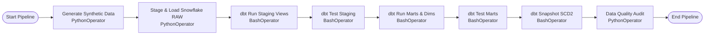

# Apache Airflow Orchestration

This directory contains the complete Apache Airflow production orchestration stack for the **Telecom Data Platform**.

## Architecture

The orchestration engine schedules and monitors the modern data pipeline:



## Available DAGs

| DAG ID | Description | Schedule | Tasks |
| :--- | :--- | :--- | :--- |
| `telecom_pipeline_dag` | End-to-end master data pipeline: Python generator -> Snowflake stage & RAW -> dbt staging -> dbt marts -> SCD2 snapshots -> Data quality audit. | `@daily` (02:00 UTC) | 10 |
| `telecom_daily_mart_refresh` | Accelerated incremental refresh of customer churn scoring, churn summary, and network performance marts. | `0 */6 * * *` (Every 6h) | 5 |

## Running with Docker Compose

1. **Initialize and start the containers**:
   ```bash
   cd airflow
   docker compose up airflow-init
   docker compose up -d
   ```

2. **Access the Airflow Web UI**:
   - URL: `http://localhost:8080`
   - Default Username: `admin`
   - Default Password: `admin`

3. **Trigger DAG**:
   - Unpause `telecom_pipeline_dag` and click **Trigger DAG**.

4. **Shutdown**:
   ```bash
   docker compose down
   ```

## Standalone DAG Verification (Without Docker)

You can validate DAG syntax, task dependencies, and run a live Snowflake data quality audit directly in Python:

```bash
python airflow/test_airflow_dags.py
```
