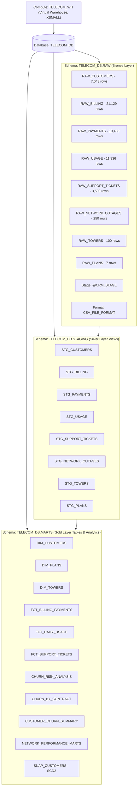

# ❄️ Snowflake Lakehouse Architecture & SQL Worksheets

This directory contains the complete infrastructure-as-code and analytical SQL worksheets for the **Telecom Data Platform** on **Snowflake**.

---

## 🏛️ Snowflake Object Hierarchy



---

## 📑 SQL Script Catalog

| Script | Title | Description | Layer |
| :--- | :--- | :--- | :--- |
| [`01_setup_warehouse_database_schemas.sql`](file:///Users/keerthana/projects/Telecom-data-platform/Telecom-data-platform/snowflake/01_setup_warehouse_database_schemas.sql) | Infrastructure Setup | Provisions `TELECOM_WH` warehouse, `TELECOM_DB` database, and `RAW`, `STAGING`, `MARTS` schemas. | Infrastructure |
| [`02_file_formats_and_stages.sql`](file:///Users/keerthana/projects/Telecom-data-platform/Telecom-data-platform/snowflake/02_file_formats_and_stages.sql) | Stages & Formats | Defines `CSV_FILE_FORMAT`, internal stage `@CRM_STAGE`, and AWS S3 integration templates. | Ingestion |
| [`03_raw_schema_ddl_and_ingestion.sql`](file:///Users/keerthana/projects/Telecom-data-platform/Telecom-data-platform/snowflake/03_raw_schema_ddl_and_ingestion.sql) | RAW DDL & COPY INTO | Creates all 8 RAW tables and executes `COPY INTO` from `@CRM_STAGE`. | RAW (Bronze) |
| [`04_staging_layer_models.sql`](file:///Users/keerthana/projects/Telecom-data-platform/Telecom-data-platform/snowflake/04_staging_layer_models.sql) | Staging Views | Pure SQL DDL for 8 Silver layer views with data cleansing and normalized types. | STAGING (Silver) |
| [`05_marts_dimensions_and_facts.sql`](file:///Users/keerthana/projects/Telecom-data-platform/Telecom-data-platform/snowflake/05_marts_dimensions_and_facts.sql) | Dimensional Modeling | Conformed dimensions (`dim_customers`, `dim_plans`, `dim_towers`) and transactional fact tables. | MARTS (Gold) |
| [`06_analytics_marts_and_churn_scoring.sql`](file:///Users/keerthana/projects/Telecom-data-platform/Telecom-data-platform/snowflake/06_analytics_marts_and_churn_scoring.sql) | Churn Risk & Network Marts | Multi-factor predictive churn risk scoring (0-100) and cell tower network performance marts. | Analytics (Gold) |
| [`07_snapshots_scd2_layer.sql`](file:///Users/keerthana/projects/Telecom-data-platform/Telecom-data-platform/snowflake/07_snapshots_scd2_layer.sql) | SCD Type 2 Snapshots | Historical change tracking for subscriber contracts and point-in-time state reconstruction. | History (SCD2) |
| [`08_data_validation_and_audit_queries.sql`](file:///Users/keerthana/projects/Telecom-data-platform/Telecom-data-platform/snowflake/08_data_validation_and_audit_queries.sql) | Data Quality Audits | Layer row count reconciliations, primary key uniqueness audits, and orphan checks. | Quality Audit |
| [`09_business_intelligence_queries.sql`](file:///Users/keerthana/projects/Telecom-data-platform/Telecom-data-platform/snowflake/09_business_intelligence_queries.sql) | BI & Executive Queries | Executive churn metrics, ARPU cohorts, tower reliability impact, and top churn risk action lists. | Analytics |

---

## 🚀 Execution Instructions

### In Snowflake Snowsight Web UI
1. Open Snowflake Snowsight.
2. Create a new SQL Worksheet.
3. Open and run each script in numerical order from `01` to `09`.

### Using SnowSQL CLI
```bash
snowsql -a AVQXGPE-JC49269 -u LIKITH -r ACCOUNTADMIN -f snowflake/01_setup_warehouse_database_schemas.sql
snowsql -a AVQXGPE-JC49269 -u LIKITH -r ACCOUNTADMIN -f snowflake/02_file_formats_and_stages.sql
snowsql -a AVQXGPE-JC49269 -u LIKITH -r ACCOUNTADMIN -f snowflake/03_raw_schema_ddl_and_ingestion.sql
```

### Automated Execution via Python
```bash
PYTHONPATH=src python src/telecom/bootstrap.py
```
